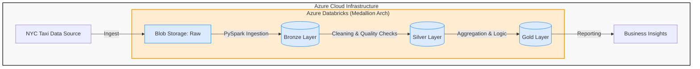

# 🚖 NYC Taxi Data Lakehouse (Azure + Databricks)
**End-to-End ELT Pipeline processing 3 million+ records using Medallion Architecture.**

## 🎯 Project Goal
To engineer a scalable **Lakehouse Architecture** on Microsoft Azure that transforms raw, high-volume transactional data (NYC Taxi trips) into trusted business insights. This project demonstrates the transition from **Bronze (Raw)** to **Silver (Clean)** to **Gold (Business-Ready)** layers, enforcing strict data quality contracts and delivering a production-grade analytics pipeline.

---

## 🏗️ Architecture Overview
This project implements a modern Lakehouse architecture on Microsoft Azure. It ingests raw taxi trip data, cleanses it using PySpark, and aggregates it into business-ready Gold tables for reporting.

---

## 📊 Executive Summary (Key Business Insights)
Based on the Gold Layer analysis, we observed the following trends:
* **Revenue Stability:** The fleet generates approximately **$2.1M - $2.2M per day** in gross revenue.
* **Trip Efficiency:** The average trip distance is **~3.2 miles**, indicating the fleet is primarily used for short, inner-city transit rather than long-haul airport runs.
* **Data Volume:** Successfully processed **~2.7 million** valid trips for January 2024 after removing ~7% of noise/ corruption.

---

## 🏗️ Tech Stack
* **Cloud:** Microsoft Azure (Resource Groups, Blob Storage)
* **Compute:** Azure Databricks (Spark 3.5, Scala 2.12)
* **Storage:** Azure Data Lake Gen2 (WASBS Protocol)
* **Orchestration:** Azure Data Factory (Planned)
* **Language:** Python (PySpark)
* **Format:** Delta Lake (ACID Transactions)

---

## 📂 Repository Structure
The project is organised into a modular pipeline, with each notebook representing a stage in the Medallion Architecture.

* **`/notebooks`** - PySpark notebooks for ingestion and transformation.
     * '1_Setup_and_Ingest.py': Initial Azure setup and secure connection configuration (WASBS).
     * '2_Ingest_Bronze.py': Ingestion logic to pull raw Parquet files from NYC TLC into the Bronze Layer.
     * '3_Transform_Silver.py': Quality enforcement pipeline; filters invalid data and write to Delat Lake.
     * '4_Analysis_Gold.py': Business aggregation logic for daily revenue reporting.
* **'README.md'**: Project documentation, architecture diagrams, and execution evidence.

---

## 📅 Progress Log
* **Phase 1: Infrastructure Setup** (Completed Jan 25)
    * Provisioned Azure Resource Group and Storage Account.
    * Deployed Azure Databricks Workspace (Standard Tier).
    * Configured Spark Cluster (Single Node) for cost optimisation.
    * Established secure connection between Databricks and Blob Storage via WASBS protocol.

* **Phase 2: Ingestion / Bronze Layer** (Completed Jan 26)
    * **Ingestion:** Programmatically downloaded NYC TLC Yellow Taxi data (Jan 2024).
    * **Storage:** Successfully moved raw Parquet files into the Azure Data Lake ('raw' container).
 
* **Phase 3: Transformation / Silver Layer** (Completed Jan 26)
    * **Cleaning:** Implemented PySpark logic to filter invalid records (negative fares, zero passengers).
    * **Schema:** Standardised column names for downsteam usability.
    * **Delta Lake:** Materialised the clean data as a **Delta Table** to enforce ACID compliance.
 
* **Phase 4: Business Aggregation / Gold Layer** (Completed Jan 26)
    * **Analytics:** Calculated daily business KPIs (Total Revenue, Total Trips, Avg Trip Distance).
    * **Reporting:** Saved aggregated "Gold" tables ready for Dashboard consumption
---

## 🏗️ ELT Pipeline Execution
The pipeline follows the **Medallion Architecture** (Bronze → Silver → Gold) to ensure data quality and traceability.

### 🥉 Phase 1 & 2: Bronze Layer (Ingestion)
**Goal:** Ingest raw historical data from external public sources into the internal Data Lake without modification.
* **Source:** NYC Taxi & Limousine Commission (TLC) Trip Record Data.
* **Method:** Programmatic extraction using Python (`requests`) to fetch monthly Parquet archives.
* **Storage:** Azure Blob Storage (Container: `raw`), utilising the **WASBS** protocol for Spark connectivity.

**Execution Evidence:**

*Figure 1: Successful ingestion of NYC Taxi data into Azure Blob Storage.*

### 🥈 Phase 3: Silver Layer (Transformation & Cleaning)
**Goal:** Cleanse and validate data to ensure it is trusted for downstream analysis.
* **Schema Enforcement:** Renamed columns from legacy formats (e.g., `tpep_pickup_datetime`) to business-standard naming conventions.
* **Data Quality Filters:**
    * Removed trips with **0 passengers** (Data Entry Errors).
    * Removed trips with **negative fares** (Refunds/Disputes).
    * **[NEW] Temporal Validation:** Filtered out ~150 records with invalid timestamps (e.g., Year 2002) to ensure downstream reporting accuracy.
* **Storage Format:** Saved as **Delta Tables** (Delta Lake) to enable **ACID transactions** and scalable metadata handling.

**Data Quality Impact:**

*Figure 2: Removed approximately ~200,000 invalid records (~7% of source data) to improve analytical accuracy.*

### 🥇 Phase 4: Gold Layer (Business Aggregation)
**Goal:** Create high-level business metrics optimised for dashboarding and reporting.

**The "Time Travel" Fix:**
*Initially, the pipeline detected records with timestamps from **2002**. I implemented a logic patch in the Silver Layer to enforce `year == 2024`, ensuring the final Gold report only contains valid current-year data.*

**Final Output:**
*Daily Revenue Analysis (Cleaned & Validated).*

*Figure 3: Validated Daily Revenue Report (Gold Layer)*

---

## 🛑 Data Quality Challenges & Solutions
During the profiling of the Silver Layer, I discovered two critical data integrity issues that required immediate logic updates.

### 1. Temporal Inconsistency ("Time Travel")
* **Issue:** Records appeared with timestamps from **2002**, likely due to misconfigured taxi meters.
* **Fix:** Implemented a strict filter `year(col("pickup_time")) == 2024`.
* **Impact:** Removed ~150 invalid records to ensure report timeline accuracy.

### 2. Physical Impossibilities (GPS Errors)
* **Issue:** Statistical profiling revealed trips with **0.0 miles** (stationary charges) and **15,400 miles** (GPS sensor glitches).
* **Fix:** Implemented physics-based thresholds (`0 < distance < 500`).
* **Impact:** Eliminated ~33,000 outlier records that would have skewed "Average Distance" metrics.

**Figure 4: Final Data Profile (Clean)**
*Verified statistics showing valid ranges (Min Distance: 0.01 miles, Max Distance: 277 miles).*

---

## 🚀 Future Roadmap
To extend this project from a proof-of-concept to a production-grade enterprise solution, I would implement the following:

* **Orchestration (Azure Data Factory):**
    * *Why:* Currently, notebooks are run manually. ADF would automate this to run on a daily schedule (e.g., 2 AM), ensuring stakeholders always have fresh data without manual intervention.
* **Visualisation (Power BI):**
    * *Why:* The Gold Layer is currently just a table. Connecting Power BI would unlock interactive dashboards, allowing business users to self-serve insights on revenue trends and fleet efficiency.
* **CI/CD (GitHub Actions):**
    * *Why:* To prevent bugs from reaching production. This would automatically run unit tests on PySpark logic whenever new code is pushed, ensuring reliability before deployment.
* **Data Governance (Unity Catalog):**
    * *Why:* To manage access control (e.g., masking PII for sensitive users) and track data lineage, ensuring compliance with data privacy regulations.
  
